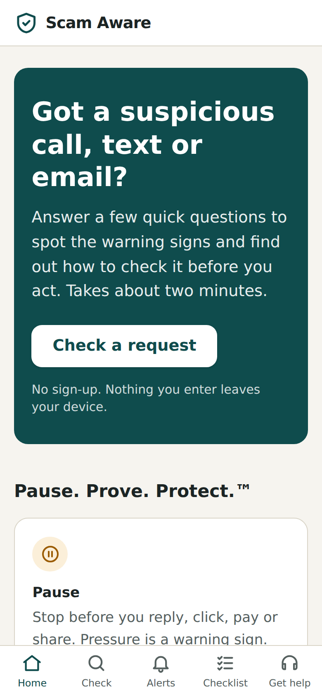
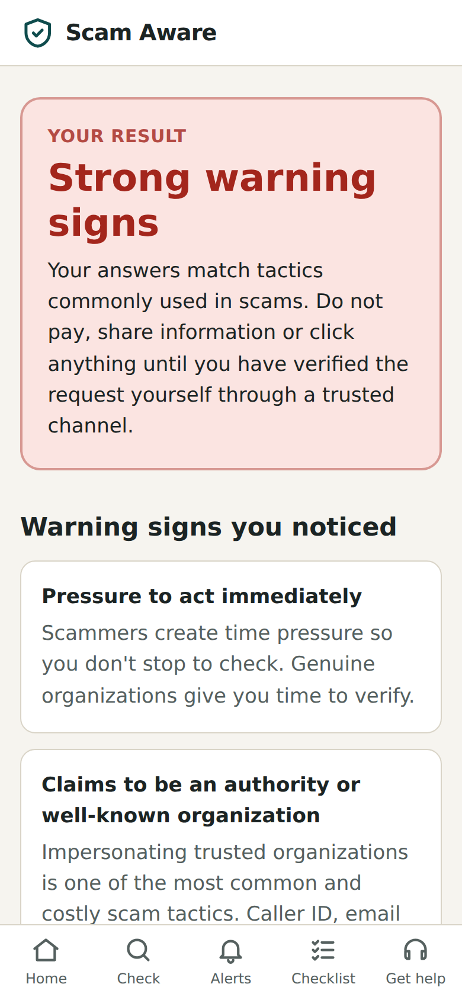
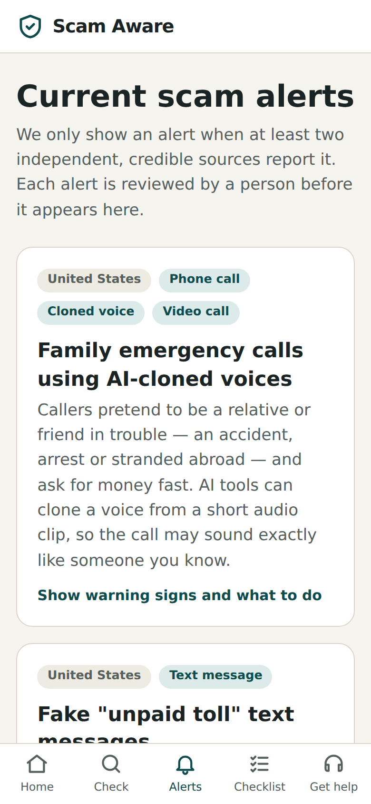

# Scam Aware

[](https://github.com/OWNER/scam-aware/actions/workflows/ci.yml)

**An evidence-grounded decision-support app for digital safety, built on the Pause.Prove.Protect.™ framework.**

Scam Aware helps people at the moment they're deciding whether to trust a suspicious call, text,
email or request. It helps them **pause**, spot manipulation tactics, **prove** the request through a
channel they already trust, and **protect** their money and personal information.

> Scam Aware is decision support, not an authority. It never tells a user that a request is safe.

**Live demo:** https://OWNER.github.io/scam-aware/ *(enabled by the Pages workflow. See [Deploy](#deploy).)*

<p align="center">
  
  
  
</p>

---

## Status: Phase 1 (v0.1.0): static MVP

Phase 1 is a rule-based, fully offline web app with **no AI and no backend**. It proves the core
experience and sets up the data contracts the AI pipeline will plug into later.
See [ROADMAP.md](ROADMAP.md) for all eight phases.

| Feature | What it does |
|---|---|
| **Guided assessment** | 12 yes / no / not-sure questions covering urgency, impersonation, secrecy, irreversible payments, credential requests, remote access and more |
| **Result screen** | *Few / Some / Strong warning signs*, why each signal matters, and tailored Pause → Prove → Protect steps |
| **Checklist** | The Pause.Prove.Protect.™ checklist. Works offline and can be printed |
| **Current alerts** | Seed alerts, each backed by **two or more independent sources**, with warning signs and verification steps |
| **Report & get help** | Official reporting channels for the US and India, plus general guidance |
| **Privacy** | No accounts, no analytics, no cookies. Answers never leave the device |
| **PWA** | Installable, and works offline after the first visit |

### Responsible-design rules enforced in code

- The assessment **cannot output "safe."** The lowest level is *"Few warning signs found"*, and it always says that this isn't a guarantee. A test checks all user-facing result text for wording like "is safe", "looks legitimate" or "not a scam".
- A "yes" to any **critical** signal (irreversible payment, credential request, secrecy, bypassing normal process) always gives *Strong warning signs*.
- "Not sure" and unanswered questions count as partial signals, because uncertainty is a reason to verify.
- **Two-source rule:** an alert is only displayed if it is `approved`, `corroborated`, and cites at least two sources from different publishers (`src/lib/alerts.ts`, tested).

See [docs/responsible-ai.md](docs/responsible-ai.md).

## Repository layout

```
scam-aware/
├── apps/web/            React + TypeScript + Vite + Tailwind PWA (Phase 1)
│   ├── src/data/        questions, alerts, checklist, resources (JSON)
│   ├── src/lib/         scoring.ts (assessment rules), alerts.ts (two-source rule)
│   ├── src/pages/       Home, Assess, Result, Checklist, Alerts, Help
│   └── tests/           Vitest unit + component tests
├── services/api/        FastAPI skeleton (Phase 2)
├── schemas/             alert.schema.json, the shared data contract
├── docs/                taxonomy, source registry, responsible-AI principles
└── .github/             CI, GitHub Pages deploy, issue templates
```

## Getting started

Requires Node.js 20+.

```bash
cd apps/web
npm install
npm run dev        # http://localhost:5173
```

| Command | Purpose |
|---|---|
| `npm test` | Run unit and component tests |
| `npm run lint` | Lint with oxlint |
| `npm run typecheck` | TypeScript type check |
| `npm run build` | Production build to `apps/web/dist` |
| `npm run preview` | Serve the production build (service worker active) |

## Deploy

**GitHub Pages (included):** in the repo settings go to *Settings → Pages → Build and deployment → Source*
and choose **GitHub Actions**. Every push to `main` then builds and publishes the app through
`.github/workflows/deploy.yml`. The app uses hash routing and relative asset paths, so it works under
`/<repo-name>/` without extra configuration.

**Vercel / Netlify:** set the root directory to `apps/web`, the build command to `npm run build`, and the output to `dist`.

## Content

- **Questions:** `apps/web/src/data/questions.json`. Each has a weight, a `critical` flag, a plain-language explanation and a follow-up action.
- **Alerts:** `apps/web/src/data/alerts.json`. These follow `schemas/alert.schema.json`, and every alert needs two or more independent sources and a `last_reviewed` date. Seed alerts were curated by hand and checked against their sources on 2026-09-26.
- **Reporting resources:** `apps/web/src/data/resources.json`

## Roadmap

| Phase | Deliverable |
|---|---|
| **1** ✅ | Static MVP: assessment, checklist, seed alerts, reporting links |
| 2 | FastAPI + PostgreSQL + vetted source registry |
| 3 | Automated ingestion with de-duplication |
| 4 | AI classification and clustering, plus an evaluation set |
| 5 | Corroboration engine and cited, grounded summaries |
| 6 | Sponsor review console (approve / revise / reject / retire) |
| 7 | iOS/Android builds with privacy-conscious features |
| 8 | Evaluation, red-teaming, accessibility audit, handover |

## Project partner

Scam Aware is a capstone project with **AI Communications Consulting**.
Pause.Prove.Protect.™ is a trademark of AI Communications Consulting.
The source code license (see [LICENSE](LICENSE)) does not grant rights to the trademark.

## Disclaimer

Scam Aware gives general safety information and cannot assess whether a specific person or message
is trustworthy. If you have lost money, contact your bank immediately and report it to the relevant authorities.
